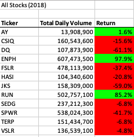

# GreenStocks-Analysis-with-VBA

## 1. Overview of Project

### 1.1. Purpose
The main purpose of this project besides the analysis of the Steve's parents stocks information for 2017 and 2018 years, is organize the information per year and also calculate the "Total Daily Volume" and  the "Return" for the different tickers along the refactoring of the VBS code to improve the script performance.

## 2. Analysis of Stocks

### 2.1. Analysis of the Performance of 2017 data
After analyzing the "Return" for the diferent tickers in 2017,as you can see in the below table. We can conclude that in 2017 there was a profit for most all the tickers except for the "TERP".In conclusion in 2017 we have a good performance for almost all the investments of Steve's parents.

  

Here we can see the performance improve from 0.27 to 0.06 for 2017.

  

### 2.2.  Analysis of the Performance of 2018 data
Unlike 2017 after analize the information summary on the below table, we can conclude that in 2018 unfornately there was a loss in the 75% of the investments, the only investments which have a profit were the followings: "AY", "ENPH", and "RUN".
For the next year we can suggest to continue investing in the following stocks: "AY", "ENPH", and "RUN", and sell "Terp" which shows losses for two consecutive years.

  

 The script time performace has improve a lot fro 2018 as well.

  

## 3. Summary
### 3.1 What are the advantages or disadvantages of refactoring code?
The purpose of code refactoring is to improve the design of existing code, and it has the following advantages and disadvantages:
### Advantages:
 * Simplified support and code updates.
 * Saved time and money in the future.
 * Reduced complexity for easier understanding
 * Maintainability and scalability

### Disadvantages:
  * Imprecise refactoring could introduce new bugs and errors into the code
  * Run out of time and money
  * Need more testing 

### 3.2.How do these pros and cons apply to refactoring the original VBA script?
These pros are applied because it allows the script to work with a large amount of data , because it has reduced the complexity, making the code the code more easy to understand it.
One of the cons could be since we are working with a large amount of data, we need to test more in order to get accurate results.
