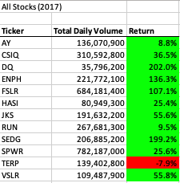

# GreenStocks-Analysis-with-VBA

## 1. Overview of Project

### 1.1. Purpose
The main purpose of this analysis is to know how different campaigns fared in relation to their launch dates and their funding goals. In other words which campains have been sucessfull, failed, and or canceled according the launch dates and their goals.

## 2. Analysis os Stocks

### 2.1. Analysis of the Performance of 2017 data
After analyzing the Outcomes in based of Launch Dates for the Play category we can conclude that the months with the highest numbers of successful campaigns were May and June and July also those months we have more campaigns launched in overall, as well as the months with the highest number of Failed campaigns were November, December.
The number of cancelled campaigns were almost constant trough the year.

  

  

### 2.2.  Analysis of the Performance of 2018 data

On Regards the Outcomes we can conclude that the campaigns with goals less than 1000 and between 1000 to 4999 have the most successfull percentage as well as the campaigns were the goal was between 35000 to 50000 and more. Percentage of Cancel campaigns remain constant. 

## 3. Summary
### 3.1 What are the advantages or disadvantages of refactoring code?

### 3.2.How do these pros and cons apply to refactoring the original VBA script?

